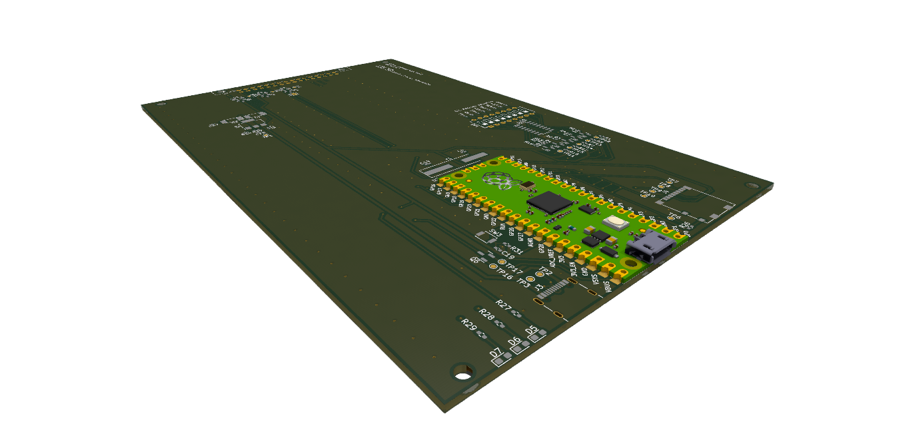

<!--
SPDX-FileCopyrightText: 2022 Sidings Media <contact@sidingsmedia.com>
SPDX-License-Identifier: CC-BY-SA-4.0
-->

# Railway Controller - Main control board

The main control board is the central control node of the railway controller
system. The main control board controls all aspects of the system, from handling
user inputs to sending commands to the control nodes.

The board is based upon the RP2040 and can either be fitted with a Raspberry Pi
Pico board or use the RP2040 chip on it's own with all the required supporting
circuitry being implemented on the board it's self. The board is designed to fit
inside a standard 3U eurocard enclosure with a depth of 160mm and a height of
100mm. The rear connector provides connectivity to the backplane to allow
communication between all nodes in the rack as well as to supply power to the
board.

The PCBs have been designed with 2 layers and with SMD components that should be
possible to hand solder with a small tip and some practice. An important note,
the boards have been designed acording to JLCPCB's design constraints, if you
are ordering from a different manufacturer, it is a good idea to make sure that
they support the same or better constraints.

This repository contains designs for the main controller board for
use with the railway controller system. Rendered versions of the schematics, for
example schematics in the PDF format, are included with the releases. Gerber
files are also included with releases. These have been generated to work with
JLCPCB but they should work with most other board manufacturers. 

## Licence
This repo uses the [REUSE](https://reuse.software) standard in order to
communicate the correct licence for the file. For those unfamiliar with
the standard the licence for each file can be found in one of three
places. The licence will either be in a comment block at the top of the
file, in a `.license` file with the same name as the file, or in the
dep5 file located in the `.reuse` directory. If you are unsure of the
licencing terms please contact
[contact@sidingsmedia.com](mailto:contact@sidingsmedia.com?subject=Railway%20Controller%20Licence).
All files committed to this repo must contain valid licencing
information or the pull request can not be accepted.
